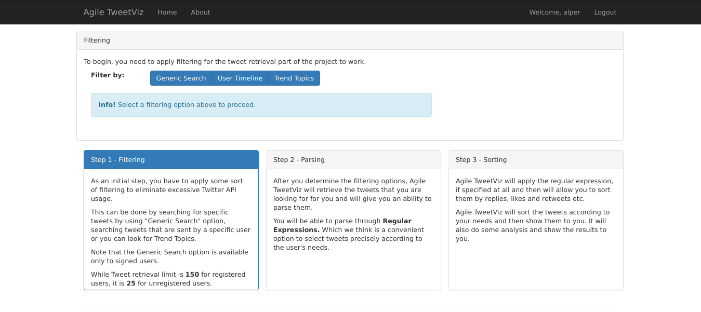

# agile-tweetviz

Tweet analysis and visualization tool implemented in Python using Tweepy. (Software Engineering Group Project)

## Getting Started

First, create a virtual environment for this project in the current directory and activate it.

```bash
$ virtualenv tweetviz
```

```bash
$ activate tweetviz/bin/activate
```

Before running the server, install the requirements.

```bash
$ pip install -r requirement.txt
```

Finally, you can run the server.

```bash
$ python TweetViz/runserver.py
```

In [localhost](http://localhost:5555/), you can see the main page:


